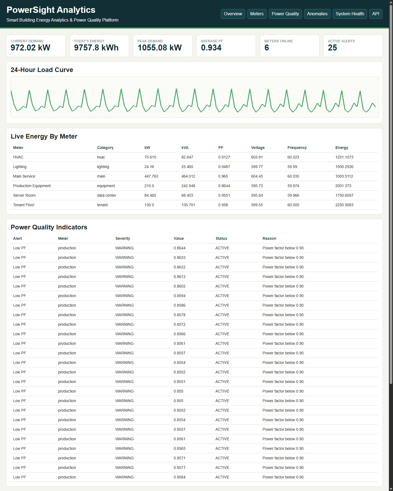
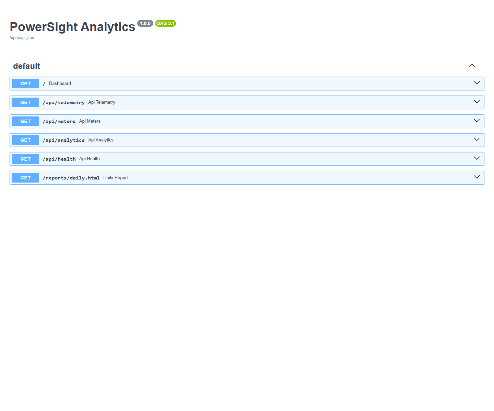
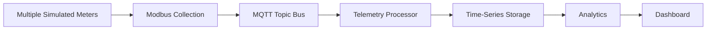

# PowerSight Analytics

Smart Building Energy Analytics & Power Quality Platform.

PowerSight Analytics is a working smart-building telemetry demo. It simulates multiple building meters, runs a telemetry pipeline, stores readings, calculates load and energy analytics, evaluates basic power-quality indicators, detects anomalies, produces rule-based observations, and exposes a dashboard, API, and downloadable daily report.

The project uses synthetic data only. It does not claim communication with physical meters or production building systems.

## Live Demo

Live demo: deployment pending.

## Screenshots

Current screenshots are captured from the running application and stored in `screenshots/`.





## Architecture



## Features

- six simulated building meters
- Modbus-style edge collection layer
- MQTT topic/message abstraction
- telemetry processor
- SQLite demo time-series storage
- Docker Compose topology with Mosquitto and PostgreSQL
- current demand, energy, peak demand, load factor, and average PF analytics
- voltage, frequency, demand, and low-PF alerts
- rolling statistical anomaly detection
- rule-based observations
- system health dashboard
- downloadable daily HTML report
- FastAPI JSON API
- automated tests and GitHub Actions

## Local Setup

```powershell
python -m venv .venv
.\.venv\Scripts\Activate.ps1
pip install -r requirements.txt
pip install -e .
uvicorn web.main:app --host 0.0.0.0 --port 8000
```

## Docker Compose

```powershell
docker compose up --build
```

The Compose topology includes `mqtt-broker`, `postgres`, and `dashboard` services.

## Testing

```powershell
pytest -q
python -m compileall src web
```

## API

- `GET /api/telemetry`
- `GET /api/meters`
- `GET /api/analytics`
- `GET /api/health`

## Current Limitations

- The public demo uses a single-container logical pipeline to stay free-hosting friendly.
- SQLite is used in the demo app; PostgreSQL is included in Compose for local extension.
- The power-quality layer is basic threshold monitoring, not waveform or harmonic analysis.
- The MQTT broker is represented by an in-process topic bus in the public demo; Docker Compose includes Mosquitto for distributed local deployment.
- Authentication is not implemented.
