# Architecture

PowerSight Analytics models a smart-building telemetry pipeline:

```mermaid
flowchart LR
    Simulator[Multiple Simulated Meters] --> Modbus[Modbus Collection Layer]
    Modbus --> MQTT[MQTT Topic Bus]
    MQTT --> Processor[Telemetry Processor]
    Processor --> Store[Time-Series Store]
    Store --> Analytics[Analytics Engine]
    Analytics --> Alerts[Alerts and Anomalies]
    Alerts --> Dashboard[FastAPI Dashboard]
```

The public demo runs the same logical pipeline in one container for free hosting. The Docker Compose file includes Mosquitto and PostgreSQL services to show the distributed deployment shape for local extension.

No physical meters are used. All telemetry is synthetic.
